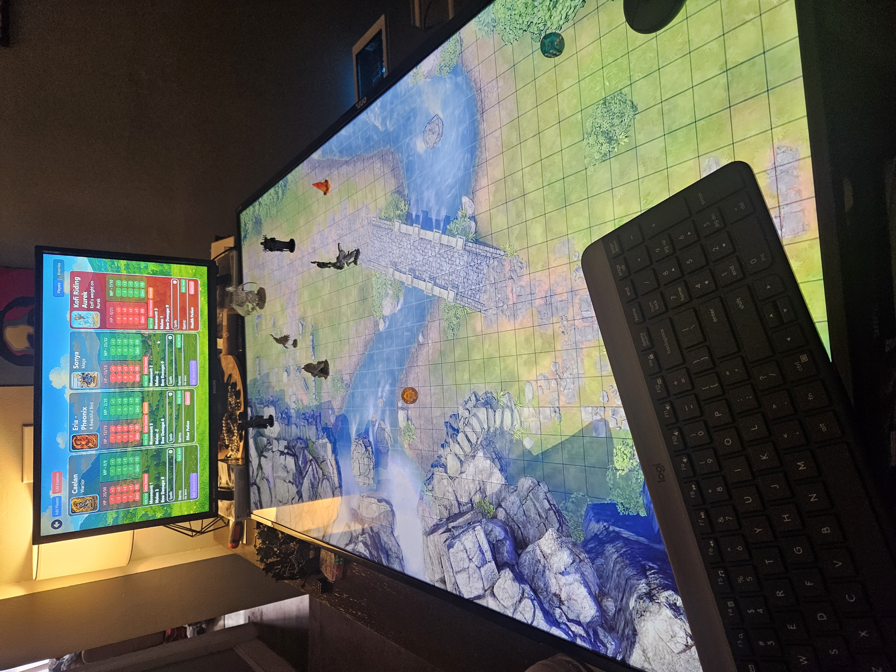
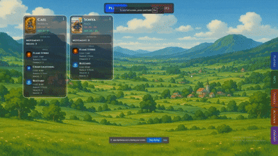

# Lunoria

A handcrafted RPG board game blending strategy, storytelling, and imagination.


---

## Project Status

This project is currently in a rough draft stage.
All core features are implemented and functional, but the application still requires:

- UI/UX polish
- Performance optimizations
- Bug fixes
- Visual refinements

Additionally, the current layout is not responsive and is best viewed on larger screens such as monitors or TVs.
Mobile and tablet support are not currently implemented and not a focus at this stage.

---

## 🎲 What Is Lunoria

**Lunoria** is a tabletop RPG inspired by games like *Dungeons & Dragons* and *Fire Emblem*.  
This companion application is **optional**, but highly recommended to enhance gameplay by tracking scenes, characters, and battles in real time.

The game is designed to be played on a **grid-based map** — whether that’s displayed on a TV or drawn on paper.  
While the software is not required, it significantly improves the **speed**, **immersion**, and **quality** of gameplay.



---

## 🧩 Recommended Equipment

While none of these items are strictly required, the following setup provides the best experience:

- 45-inch TV (for displaying the map)
- A monitor for the tracking system
- Mouse and keyboard
- Various 3D models or tokens
- A 6-sided die
- Speakers for background music
- YouTube (for animated gridded maps)

---

## 🕹️ How to Play

This section explains how to play **Lunoria** using the companion app.  
All mechanics can also be managed manually with pen and paper if preferred.

### Overview

Each game session consists of a **Journey**, which is similar to a *campaign* or *mission series* in other RPGs.  
A Journey is made up of multiple **Scenes**, each representing an encounter or narrative moment.

Each Journey can have one or more **players**, with each person controlling as many characters as they wish.  
Scenes also include **NPCs** (non-player characters) and **Enemies**, which are typically controlled by the **operator** — the person managing the tracking system.

It is recommended that the operator also serves as the **narrator**, reading story dialogue and managing combat flow.

---

### Using the Application

When ready to play, the operator selects **“Play Scene”** from the Journey Details page.  
This opens the **Scene Dashboard**, where the actual gameplay takes place.


At this point, all players should be positioned on one section of the map, and enemies scattered appropriately.  
Use the tabs at the top — **Players**, **NPCs**, and **Enemies** — to switch between character types and reduce on-screen clutter.

---

### Activation Rules

Not all enemies are active at the start of a scene.  
An enemy becomes **activated** when any player moves within **five tiles** of them.  

Currently, **turn cycles** are not automatically tracked by the software — the operator must manage these manually.  
This feature is planned for a future update.

---

### Combat and Movement

1. **Movement**
   - Each player rolls a die at the start of their turn.  
   - Add the roll to your character’s **movement stat** to determine total movement distance.  
   - Movement is limited to horizontal and vertical tiles (no diagonal movement).  
   - This restriction also applies when determining if an enemy is within activation range.

2. **Attacks**
   - **Melee attacks** require the player to be directly adjacent (not diagonal) to an enemy.  
   - **Bow attacks** can target enemies within 2 tiles.  
   - **Spell attacks** have variable range, determined by the operator.

3. **Damage Calculation**
   - Roll a die and add the result to the character’s attack stat.  
   - Apply the total to the target’s HP.  
   - When using a spell, reduce MP by the spell’s cost.  
   - HP and MP changes are applied manually in the dashboard’s side panel.

4. **Defeated Enemies**
   - When an enemy is defeated, the operator removes it from the board.  
   - The player who dealt the final blow receives a **drop**, granting **+4 HP** or **+4 MP**.

5. **Dialog**
   - Each scene can include **dialogue pages** to enrich storytelling.  
   - To create dialogue, navigate to the **Journey Details** page (where all scenes for a journey are listed), and click **“View Dialog.”**  
   - From this page, you can create new dialogues, add pages, and organize sections within each page as needed.  
   - To display dialogue in the side pane during gameplay, click the **Dialog** button and select any of the created dialogue entries.



---

### Items and Inventory

The operator can place items (e.g., treasure chests) throughout the map.  
When a player collects an item:

- Ensure the player’s inventory has available space.  
- Add the item to their inventory via the app.  
- Apply any effects (e.g., healing, stat boosts) manually.  

When an item is used, it’s the operator’s responsibility to adjust player stats accordingly.

---

## 🧠 Tech Stack

- **Frontend:** React, TypeScript  
- **Backend:** ASP.NET Core, C#, Entity Framework

---

## ⚙️ Installation

Clone the repository and install dependencies:

Note: You also need to have a azure account with a blob storage container. The appsettings.json file in the api will also need to be updated with those credentials.

```bash
git clone https://github.com/JoshuaDJones/Lunoria.git
cd Lunoria
npm install


