# Entity relationship diagram

This diagram reflects the EF Core model in `ApplicationDbContextModelSnapshot.cs`. It includes every mapped entity relationship, including optional source links retained by immutable playthrough records and the implicit `EquippableItemSpell` join entity.

```mermaid
erDiagram
    USER ||--o{ CHARACTER : "owns (UserId)"
    USER ||--o{ CONSUMABLE_ITEM : "owns (UserId)"
    USER ||--o{ EQUIPPABLE_ITEM : "owns (UserId)"
    USER ||--o{ SERIES : "owns (UserId)"
    USER ||--o{ JOURNEY : "owns (UserId)"
    USER ||--o{ JOURNEY_REVISION : "creates (CreatedByUserId)"
    USER ||--o{ SPELL : "owns (UserId)"
    USER ||--o{ SPELL_TYPE : "owns (UserId)"

    CHARACTER o|--o| CHARACTER : "base alternate form (BaseAlternateFormId)"
    CHARACTER ||--|| CHARACTER_DIALOG_SETTINGS : "has settings (CharacterId)"
    CHARACTER ||--o{ CHARACTER_SPELL : "learns (CharacterId)"
    SPELL ||--o{ CHARACTER_SPELL : "assigned by (SpellId)"
    CHARACTER o|--o{ CHARACTER_STAT_ADJUSTMENT_ACTION : "targets (CharacterId)"

    SPELL_TYPE ||--o{ SPELL : "classifies (SpellTypeId)"
    SPELL_TYPE o|--o{ EQUIPPABLE_ITEM : "affected by (AffectedSpellTypeId)"
    SPELL ||--o{ EQUIPPABLE_ITEM_SPELL : "added spell (AddedSpellsId)"
    EQUIPPABLE_ITEM ||--o{ EQUIPPABLE_ITEM_SPELL : "grants spell (EquippableItemsId)"

    SERIES ||--o{ JOURNEY : "contains (SeriesId)"
    JOURNEY ||--o{ JOURNEY_CHARACTER : "includes (JourneyId)"
    CHARACTER ||--o{ JOURNEY_CHARACTER : "base character (CharacterId)"
    CHARACTER o|--o{ JOURNEY_CHARACTER : "alternate form (AlternateFormId)"
    JOURNEY_CHARACTER ||--o{ JOURNEY_CHARACTER_SPELL : "has spell (JourneyCharacterId)"
    SPELL ||--o{ JOURNEY_CHARACTER_SPELL : "references (SpellId)"
    JOURNEY ||--o{ JOURNEY_INTRO_PAGE : "has intro page (JourneyId)"
    JOURNEY o|--o{ JOURNEY_REVISION : "source journey (SourceJourneyId)"
    JOURNEY o|--o{ JOURNEY_PLAYTHROUGH : "live source (JourneyId)"
    JOURNEY_REVISION ||--o{ JOURNEY_PLAYTHROUGH : "frozen revision (JourneyRevisionId)"

    JOURNEY_PLAYTHROUGH ||--o{ JOURNEY_PLAYTHROUGH_CHARACTER : "snapshots characters (JourneyPlaythroughId)"
    JOURNEY_CHARACTER o|--o{ JOURNEY_PLAYTHROUGH_CHARACTER : "optional source (JourneyCharacterId)"
    JOURNEY_PLAYTHROUGH_CHARACTER o|--o| JOURNEY_PLAYTHROUGH_CHARACTER : "alternate form (AlternateFormId)"
    JOURNEY_PLAYTHROUGH ||--o{ JOURNEY_PLAYTHROUGH_EVENT_LOG : "records (JourneyPlaythroughId)"

    JOURNEY_PLAYTHROUGH_CHARACTER ||--o{ JOURNEY_PLAYTHROUGH_CHARACTER_CONSUMABLE_ITEM : "holds (JourneyPlaythroughCharacterId)"
    CONSUMABLE_ITEM o|--o{ JOURNEY_PLAYTHROUGH_CHARACTER_CONSUMABLE_ITEM : "optional source (ConsumableItemId)"
    JOURNEY_PLAYTHROUGH_CHARACTER ||--o{ JOURNEY_PLAYTHROUGH_CHARACTER_EQUIPPABLE_ITEM : "holds (JourneyPlaythroughCharacterId)"
    EQUIPPABLE_ITEM o|--o{ JOURNEY_PLAYTHROUGH_CHARACTER_EQUIPPABLE_ITEM : "optional source (EquippableItemId)"
    JOURNEY_PLAYTHROUGH_CHARACTER ||--o{ JOURNEY_PLAYTHROUGH_CHARACTER_SPELL : "knows (JourneyPlaythroughCharacterId)"
    JOURNEY_CHARACTER_SPELL o|--o{ JOURNEY_PLAYTHROUGH_CHARACTER_SPELL : "optional source (JourneyCharacterSpellId)"

    JOURNEY ||--o{ SCENE : "contains (JourneyId)"
    SCENE ||--o{ SCENE_CHARACTER : "includes (SceneId)"
    CHARACTER ||--o{ SCENE_CHARACTER : "base character (CharacterId)"
    CHARACTER o|--o{ SCENE_CHARACTER : "alternate form (AlternateFormId)"
    SCENE_CHARACTER ||--o{ SCENE_CHARACTER_SPELL : "has spell (SceneCharacterId)"
    SPELL ||--o{ SCENE_CHARACTER_SPELL : "references (SpellId)"

    SCENE ||--o{ SCENE_CHEST : "has chest (SceneId)"
    SCENE_CHEST ||--o{ SCENE_CHEST_LOOT_ENTRY : "contains loot (SceneChestId)"
    CONSUMABLE_ITEM o|--o{ SCENE_CHEST_LOOT_ENTRY : "consumable choice (ConsumableItemId)"
    EQUIPPABLE_ITEM o|--o{ SCENE_CHEST_LOOT_ENTRY : "equippable choice (EquippableItemId)"

    SCENE ||--o{ SCENE_DIALOG : "has dialog (SceneId)"
    SCENE_DIALOG ||--o{ DIALOG_PAGE : "has page (SceneDialogId)"
    DIALOG_PAGE ||--o{ DIALOG_PAGE_SECTION : "has section (DialogPageId)"
    CHARACTER o|--o{ DIALOG_PAGE_SECTION : "speaker (CharacterId)"

    SCENE ||--o{ SCENE_EVENT : "has event (SceneId)"
    SCENE_EVENT ||--o{ SCENE_EVENT_ACTION : "has action (SceneEventId)"
    SCENE_EVENT_ACTION ||--o| CHARACTER_STAT_ADJUSTMENT_ACTION : "stat adjustment (SceneEventActionId)"
    SCENE ||--o| SCENE_GRID : "has grid (SceneId)"
    SCENE ||--o{ SCENE_INTRO_PAGE : "has intro page (SceneId)"

    JOURNEY_PLAYTHROUGH ||--o{ SCENE_PLAYTHROUGH : "runs scenes (JourneyPlaythroughId)"
    SCENE o|--o{ SCENE_PLAYTHROUGH : "optional source (SceneId)"
    SCENE_PLAYTHROUGH_PARTICIPANT o|--o{ SCENE_PLAYTHROUGH : "current participant (CurrentParticipantId)"

    SCENE_PLAYTHROUGH ||--o{ SCENE_PLAYTHROUGH_CHARACTER : "snapshots characters (ScenePlaythroughId)"
    SCENE_CHARACTER o|--o{ SCENE_PLAYTHROUGH_CHARACTER : "optional source (SceneCharacterId)"
    SCENE_PLAYTHROUGH_CHARACTER o|--o| SCENE_PLAYTHROUGH_CHARACTER : "alternate form (AlternateFormId)"

    SCENE_PLAYTHROUGH_CHARACTER ||--o{ SCENE_PLAYTHROUGH_CHARACTER_CONSUMABLE_ITEM : "holds (ScenePlaythroughCharacterId)"
    CONSUMABLE_ITEM o|--o{ SCENE_PLAYTHROUGH_CHARACTER_CONSUMABLE_ITEM : "optional source (ConsumableItemId)"
    SCENE_PLAYTHROUGH_CHARACTER ||--o{ SCENE_PLAYTHROUGH_CHARACTER_EQUIPPABLE_ITEM : "holds (ScenePlaythroughCharacterId)"
    EQUIPPABLE_ITEM o|--o{ SCENE_PLAYTHROUGH_CHARACTER_EQUIPPABLE_ITEM : "optional source (EquippableItemId)"
    SCENE_PLAYTHROUGH_CHARACTER ||--o{ SCENE_PLAYTHROUGH_CHARACTER_SPELL : "knows (ScenePlaythroughCharacterId)"
    SCENE_CHARACTER_SPELL o|--o{ SCENE_PLAYTHROUGH_CHARACTER_SPELL : "optional source (SceneCharacterSpellId)"

    SCENE_PLAYTHROUGH ||--o{ SCENE_PLAYTHROUGH_CHEST : "tracks chests (ScenePlaythroughId)"
    SCENE_CHEST o|--o{ SCENE_PLAYTHROUGH_CHEST : "optional source (SceneChestId)"
    SCENE_CHEST_LOOT_ENTRY o|--o{ SCENE_PLAYTHROUGH_CHEST : "selected loot (SelectedLootEntryId)"
    SCENE_PLAYTHROUGH ||--o{ SCENE_PLAYTHROUGH_EVENT : "tracks events (ScenePlaythroughId)"
    SCENE_EVENT o|--o{ SCENE_PLAYTHROUGH_EVENT : "optional source (SceneEventId)"

    SCENE_PLAYTHROUGH ||--o{ SCENE_PLAYTHROUGH_PARTICIPANT : "has participants (ScenePlaythroughId)"
    JOURNEY_PLAYTHROUGH_CHARACTER o|--o{ SCENE_PLAYTHROUGH_PARTICIPANT : "player participant (JourneyPlaythroughCharacterId)"
    SCENE_PLAYTHROUGH_CHARACTER o|--o{ SCENE_PLAYTHROUGH_PARTICIPANT : "scene participant (ScenePlaythroughCharacterId)"

    EQUIPPABLE_ITEM_SPELL {
        int AddedSpellsId PK, FK
        int EquippableItemsId PK, FK
    }
```

## Cardinality legend

- `||` — exactly one
- `o|` — zero or one
- `o{` — zero or many

The cardinality beside a principal shows whether the dependent foreign key is required (`||`) or nullable (`o|`). Collection ends are shown as zero-or-many because EF/database constraints do not require a principal row to have dependents.

`EquippableItemSpell` is EF Core's implicit join entity for the many-to-many relationship between `EquippableItem.AddedSpells` and `Spell.EquippableItems`.

`SceneChestLootEntry` can reference a consumable item, an equippable item, or neither at the foreign-key level. Likewise, a `ScenePlaythroughParticipant` can optionally reference a journey character and/or a scene character; any exclusive-choice rule is application logic rather than a foreign-key cardinality constraint.
